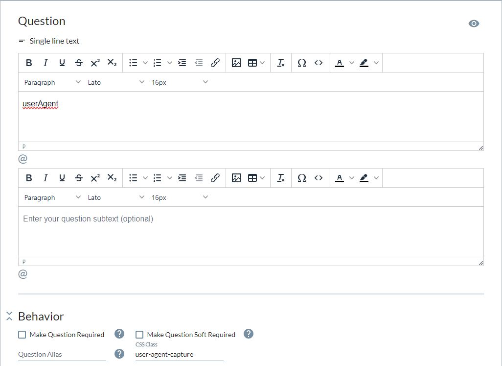
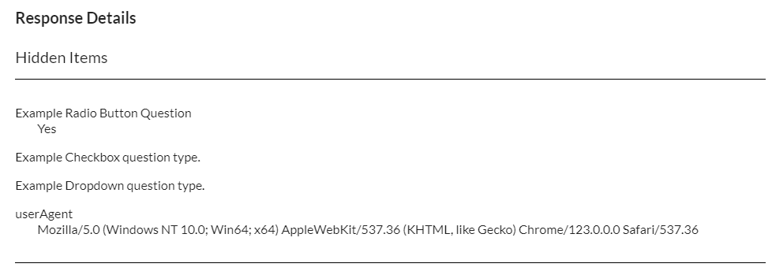

# capture-device-information
The `capture-device-information.js` script can be used in Checkbox's [JavaScript Action Item](https://www.checkbox.com/help-center-questions/how-to-inject-custom-javascript-into-a-survey-question-or-page) feature to automatically capture device information and submit it alongside information submitted by the respondent.

Code placed into a JavaScript Action Item executes automatically when the user loads the survey page and can be configured to your liking. For example, should the fields be hidden from the respondent? Should they be read-only? Exactly what data is captured? etc.

The usage of this example will require a Checkbox account (Online or On-Premises) and certain configuration of the survey, as outlined below in the Usage section.

> [!WARNING]
> This code is for exemplary purposes only. Before collecting any data regarding respondents, ensure that it adheres to any relevant regulations regarding user data privacy and security. Use at your own discretion.

## Usage
### Preparing the Survey

#### 1. Create Survey Question for Each Datapoint
First, you will need to add a Single Line Text question to the survey for each data point you want to capture. The example here captures the `navigator.userAgent` value, and so we create a question simply called "userAgent":

Note that in this case a CSS Class of `user-agent-capture` was added to the question. This CSS Class will be used to select the question in the JavaScript. Each question you add should have a unique CSS Class associated with it.

#### 2. Add JavaScript Action Item
Under the Single Line Text question(s) added above, add a [JavaScript Action Item](https://www.checkbox.com/help-center-questions/how-to-inject-custom-javascript-into-a-survey-question-or-page) to the survey and enter the relevant JavaScript, outlined here in this example.

> [!IMPORTANT]
> In this example, we are only setting capturing the `userAgent`. If you would like to capture additional data points, the JavaScript will need to be updated accordingly.

#### 3. Send the Survey
After the survey has been fully configured, ensure the status of the survey is set to `Active` and send it as you would any other Checkbox Survey. For example, via email, SMS, socials, etc.

### Capturing the Data

With the survey configured and sent, the data will live alongside other question answers, as if it were entered by the user themselves:

This data can now be analyzed or exported as any other data collected in the survey.
