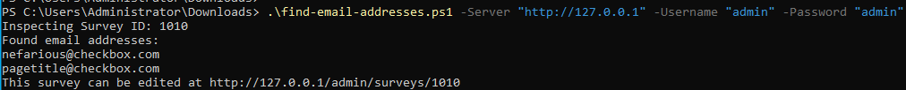

# find-email-addresses

This script allows you to easily scan the entire text contents of all your surveys, returning information about any that contain email addresses.  This can be used to ensure employees are not leaking addresses in public surveys.
The script could easily be altered to scan for a text value instead.
This script as written will only work on-premise but could be easily modified to work with a Checkbox Online acount.


## Usage

The parameters "Server" "Username" and "Password" are optional, but do not have very useful default values ("http://127.0.0.1", "admin", and "admin" respectively).

You should enter your values as follows:

```ps1
.\find-email-addresses.ps1 -Server "http://127.0.0.1" -Username "admin" -Password "admin"
```
Of course, hopefully your server has a more secure username and password!

When the application runs, it will update with each found email address within your surveys, and make a note of where the surveys can be edited.


